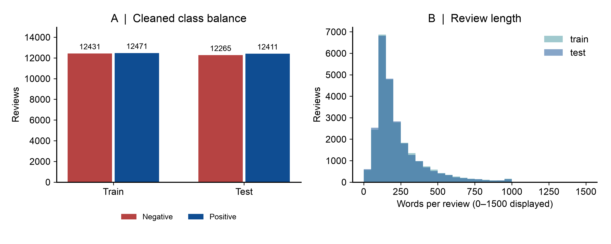
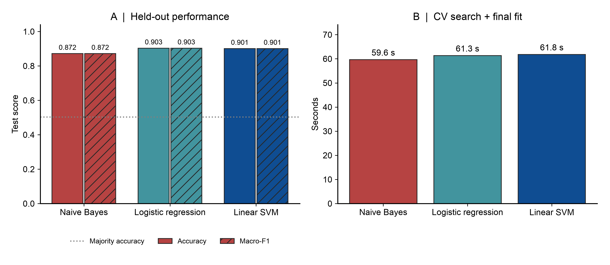
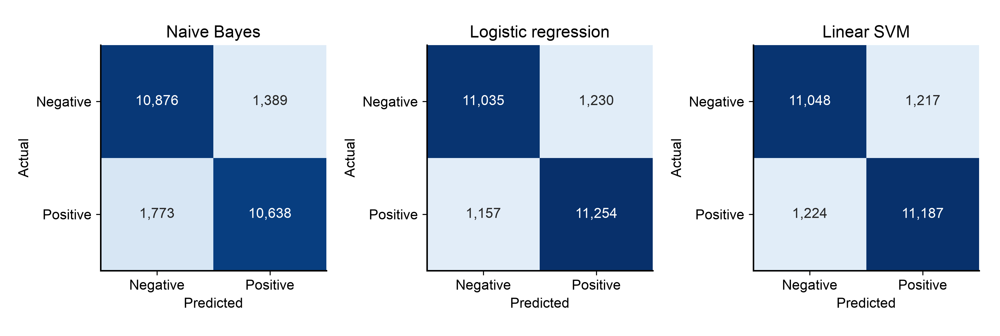
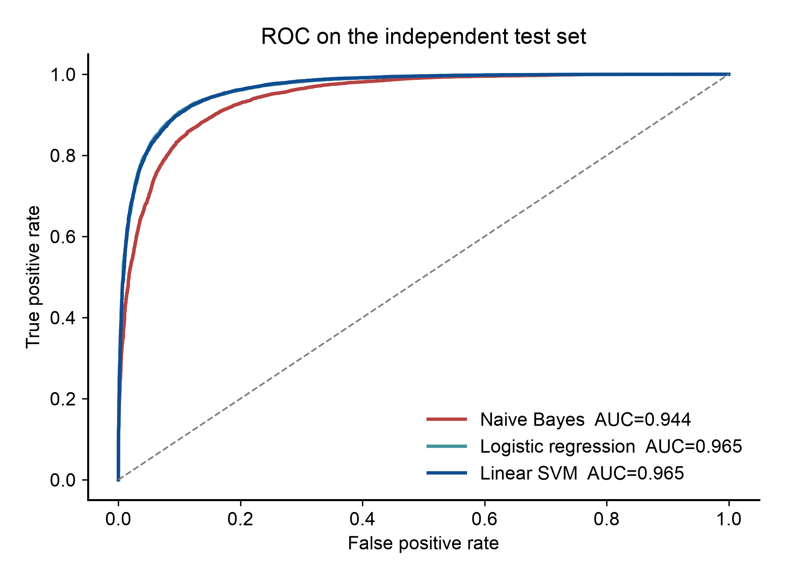
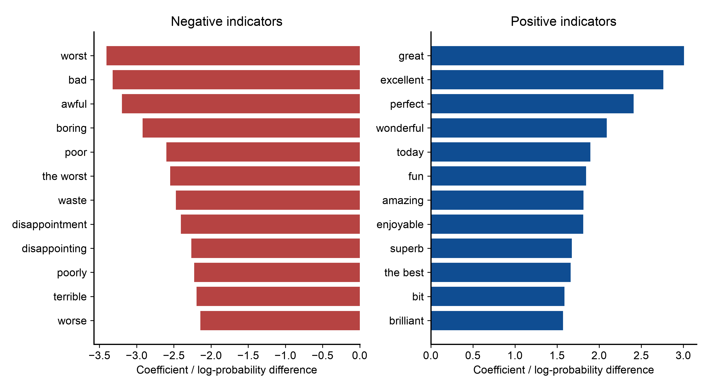

# IMDb 评论情感分类综合实验报告

## 1. 研究问题与数据

问题：仅根据英文评论正文，判定电影评论的正面或负面情感。数据来源：Stanford Large Movie Review Dataset（Maas et al., 2011），https://ai.stanford.edu/~amaas/data/sentiment/ 。
采集器读取发布页 HTML、发现下载链接、检查 robots.txt、重试并流式下载公开数据包。它是公开数据集采集器，不是直接爬取 IMDb 网站评论的程序。原始有标签评论 50,000 条；另外 50,000 条无标签评论不参与本实验。
评分 ≥7 为正面、≤4 为负面；中间评分不在本二分类样本中。英文电影评论结论不直接推广至中文、电商或中性评论。

## 2. 清洗与实验设计

清洗 HTML 标签、HTML 实体、重复空白并统一小写，保留否定词。按规范化正文 SHA-256 去重；同一划分内矛盾标签文本全部剔除；跨划分重复只从测试集移除。共移除 422 条，保留 49,578 条，其中训练 24,902 条、独立测试 24,676 条。详见 artifacts/results/data_audit.json。
沿用官方训练/测试划分，不将测试样本混入训练。三个模型使用相同 TF-IDF 1–2 gram、最多 40,000 个特征；min_df=3、max_df=0.98、sublinear_tf=True。词表和 IDF 在每个 CV 训练折内部拟合。评分、ID、文件名、split 均不进入特征。
训练集采用固定 seed=42 的分层 3 折交叉验证；朴素贝叶斯搜索 alpha∈{0.5,1.0}，逻辑回归/线性 SVM 搜索 C∈{0.5,2.0}。由训练 CV macro-F1 选择模型并写入 selection.json 后，才进行独立测试评估。每个模型同时报告测试表现用于方法对比，禁止用这些结果反复调整参数。

## 3. 模型选择理由

- 多项式朴素贝叶斯：使用条件独立假设估计情感类别，适合稀疏非负文本特征，训练成本低。TF-IDF 是常见工程用法，非严格词频生成模型。
- 逻辑回归：以正则化线性决策函数建模，适合高维稀疏数据，可输出正面类别概率；概率未做校准。
- 线性 SVM：以最大间隔优化决策边界，适合稀疏高维文本；输出决策分数，不是概率。
- 多数类基线：不读正文，衡量分类器是否学到有效信息；其测试准确率 50.30%。

## 4. 量化结果（真实运行）

| 模型 | CV macro-F1 | 测试准确率 | 正面 Precision | 正面 Recall | 测试 macro-F1 | ROC-AUC | 搜索+重拟合/秒 | 准确率95% CI |
|---|---:|---:|---:|---:|---:|---:|---:|---|
| Naive Bayes | 87.90% | 87.19% | 88.45% | 85.71% | 87.18% | 0.9443 | 59.6 | 86.74%–87.58% |
| Logistic regression | 89.92% | 90.33% | 90.15% | 90.68% | 90.33% | 0.9652 | 61.3 | 89.95%–90.68% |
| Linear SVM | 90.07% | 90.11% | 90.19% | 90.14% | 90.11% | 0.9649 | 61.8 | 89.72%–90.45% |

按 CV 选择的模型为 **Linear SVM**，测试准确率 **90.11%**、macro-F1 **90.11%**。准确率比多数类基线提高 39.81 个百分点。
准确率95% CI：89.72%–90.45%。使用 1000 次评论级有放回 bootstrap，同一组索引用于各模型，得到配对准确率差值区间（见 metrics.json）。这只度量测试样本抽样不确定性，不包含训练随机性或电影聚类影响。
CV 标准差描述三折差异，不是置信区间。search_seconds 包含向量化、全部候选 CV 和最终重拟合；refit_seconds 仅包含最佳 Pipeline 重拟合；耗时依赖设备，不能与其他机器的耗时直接比较。

本机搜索耗时最少的是 Naive Bayes（59.6 秒）。CV 所选模型的搜索耗时为 61.8 秒，相对该最快模型的测试准确率差值为 +2.92 个百分点。这同时比较了预测效果与计算成本；搜索包含特征计算，不等同于分类器本身的速度。

本次独立测试准确率最高的是 Logistic regression（90.33%），比 CV 所选模型高 0.22 个百分点。训练 CV 与独立测试排序可能不同；本实验保留事先按训练 CV 作出的选择，不依据测试表现改选模型。

- Naive Bayes：最佳参数 `{'clf__alpha': 1.0}`；CV macro-F1 标准差 0.0007；CV 训练/验证 Macro-F1 差 3.94 个百分点；最终词表 40,000；重拟合 7.1s；测试预测及分数计算 7.5s。
- Logistic regression：最佳参数 `{'clf__C': 2.0}`；CV macro-F1 标准差 0.0023；CV 训练/验证 Macro-F1 差 7.04 个百分点；最终词表 40,000；重拟合 7.7s；测试预测及分数计算 7.5s。
- Linear SVM：最佳参数 `{'clf__C': 0.5}`；CV macro-F1 标准差 0.0017；CV 训练/验证 Macro-F1 差 9.26 个百分点；最终词表 40,000；重拟合 7.6s；测试预测及分数计算 7.7s。

训练/验证差值用于观察模型对训练文本的拟合程度；差值较大提示泛化差距，但不能仅据此证明过拟合机制。

## 5. 错误分析与解释

混淆矩阵行是真实标签、列是预测标签，顺序均为负面/正面。Precision、Recall、F1 默认以正面为正类；macro-F1 对两类 F1 等权平均。ROC-AUC 根据连续决策分数计算，不对硬标签计算 AUC。
artifacts/results/error_examples.csv 按真实标签各保存所选模型最多40条误判，网页每类显示最多6条，可按真实类别筛选。这是分组后按ID排列的定性示例，正文最多截取1500字符，不是随机抽样。否定、讽刺、长距离语义和混合评价是值得人工检查的机制假设，不应把示例归因视作已验证事实。
词语系数表示当前训练数据中的关联，不代表因果或人工解释的真实性。长度分组准确率仅为描述性事后分析，不用于选择模型：

| 评论长度 | 数量 | 所选模型准确率 |
|---|---:|---:|
| <100 words | 3138 | 90.63% |
| 100–299 words | 16267 | 90.21% |
| >=300 words | 5271 | 89.47% |

## 6. 局限与改进

数据只有强极性的英文电影评论，未覆盖中性、跨领域、跨语言及新时期数据。仅按规范化文本去重，不能完全排除近似复述或同电影相关性。比较了三个算法但每类仅两个参数，搜索空间有限；测试集清理使分数不能直接与原始25,000条排行榜对照。未来可先确定新的验证方案，再比较 CountVectorizer、更多参数、校准或预训练语言模型，最终使用新保留测试集评估。

## 7. 可复现性与引用

配置见 configs/experiment.json，当前运行配置见 artifacts/results/run_config.json，环境版本见 metrics.json 和 requirements-lock.txt，数据包来源与 SHA-256 见 data/raw/provenance.json。校验值是本次采集指纹，并非发布方签名。
命令与讲解见 README.md、docs/presentation_guide.md。生成时间：2026-09-28T02:17:08.768914+00:00。

Maas, A. L., Daly, R. E., Pham, P. T., Huang, D., Ng, A. Y., & Potts, C. (2011). Learning Word Vectors for Sentiment Analysis. ACL-HLT, 142–150. https://aclanthology.org/P11-1015/
